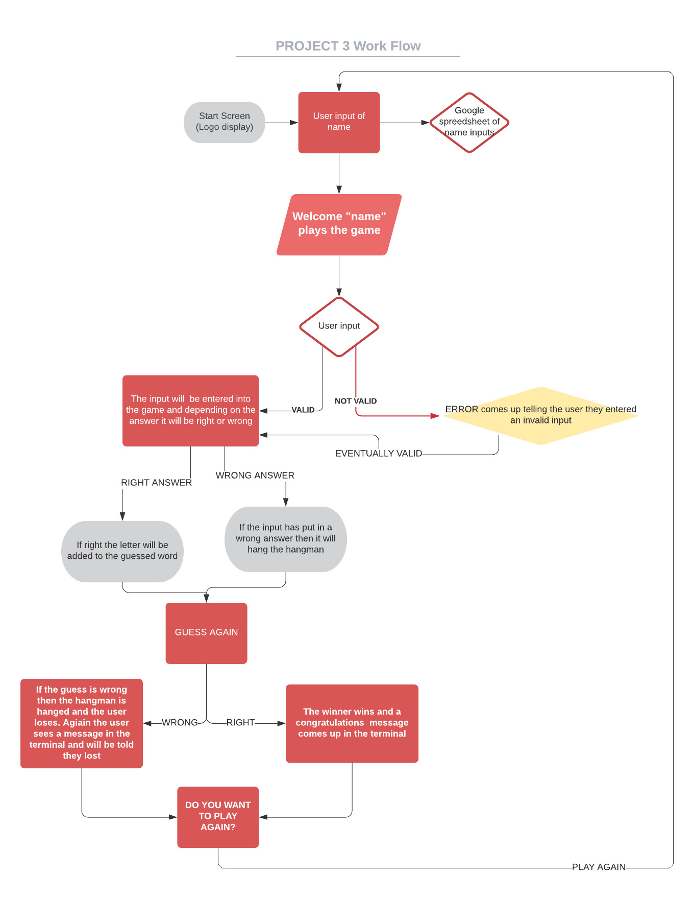
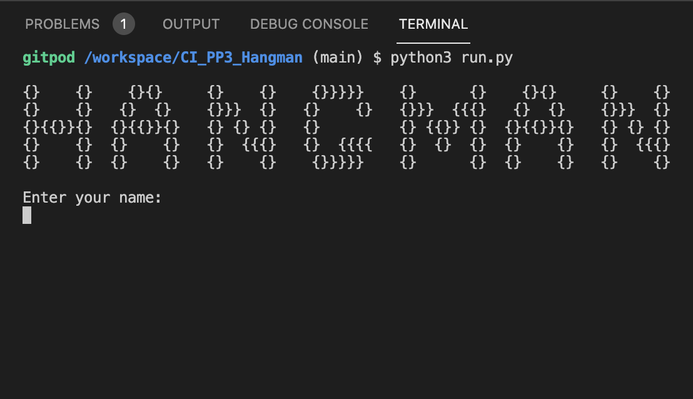
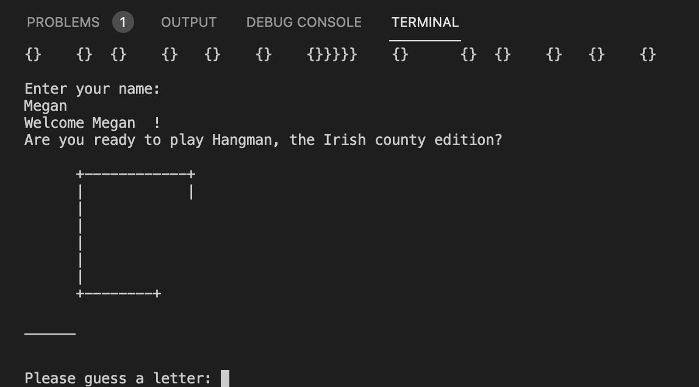
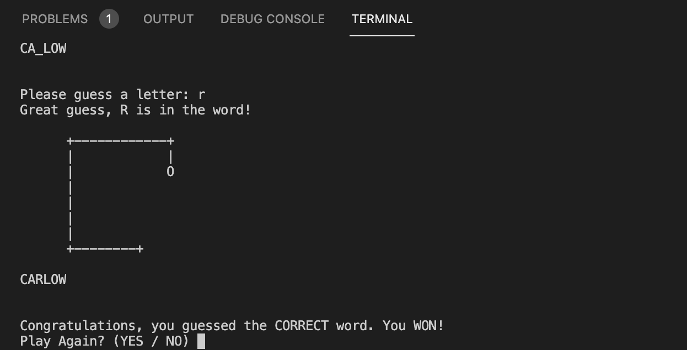
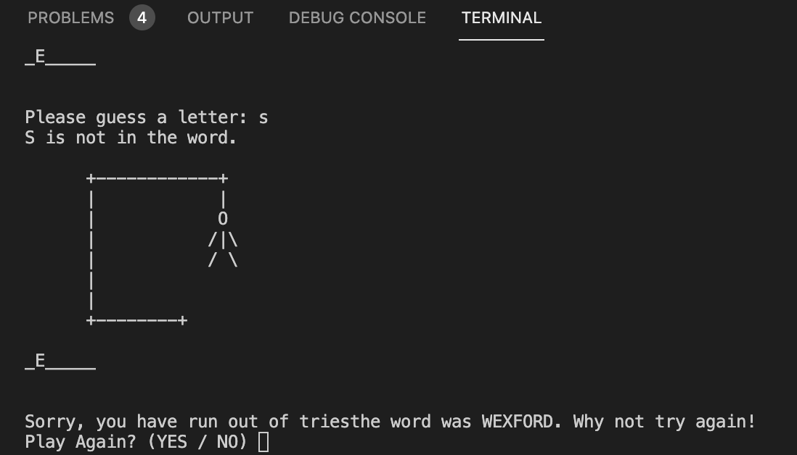

# Hangman - Irish Counties Edition
 
[Veiw the project here]()
1. [Project Goals](#project-goals)
2. [User Experience](#user-experience)
    1. [Target Audience](#target-audience)
    2. [User Requirements](#user-requirements)
    3. [User Stories](#user-stories)
    3. [Flow Chart](#flow-chart)
4. [Technology](#technology)
    1. [Develpoment Languages Used](#develpoment-languages-used)
    2. [Frameworks and Tools used](#frameworks-and-tools-used)
5. [Features](#features)
6. [Testing](#testing)
    1. [Python Validation](#HTML-validation)
    2. [Testing user stories](#testing-user-stories)
8. [Bugs](#Bugs)
9. [Deployment](#deployment)
10. [Credits](#credits)
11. [Acknowledgements](#acknowledgements)

## Project Goals 
<ul>
    <li> The main goal of this project is to allow users to play a hangmna game beased on the counties of Ireland so they can test their knowledge.</li>
    <li>It also aims to create a game with a good user experience that offers real world feedback to the user.</li>
    <li> Finally the game is connect to a database (google spreadsheets) to allow the owner of the game to host a platform that will gather user information that could be use for the site's analytics.</li>
</ul>

### User Experience:

### Target Audience 

 The target audience for this site is quite broad. Hangman is a game that is easily understanded by those who play it, but as the topic of the game is teh Irish counties, this restricts those that can play the game. Because of this the target audience of this game is limited to residents of Ireland and those that have access to a computer - which is still quite broad. 

### User Requirements

As I have mentioned, we have a very large/ yet restricted target audience, and becasue of this the site has to be simple in design and very accessible, to those who have computers and have geographical knowledge of Ireland. Aiding this knowledge I have created a game with:

<ul>
    <li> Straightforward navigation through intro and game play, including a possibility to replay the game.</li>
    <li>The game has real time feedback for users which allows them to understand if their guess is right, wrong or invalid.</li>
    <li> The option to personalise the game by entering your name. <li>
</ul>

### User Stories

### First time and Recurring Stories
<ol>
    <li>As a user, I want to be able to play the hangman game that will test my knowledge of the Irish counties.</li>
    <li>As a user, I want to be able to use the game as a spelling test to revise for Irish Geography quizes at school.</li>
    <li>As a user, I would like to be able to personalise the game and enter my name.</li>
    <li>As a user who not tech savy, I want to be able know how to play the game with very little technical advancity.</li>
    <li>As a user who doesn't understand websites, I want to easily see if I have guessed the question wrong or right.
    </li>
    <li>As a user, i want real time feedback telling me if my guess was right or wrong.</li>
</ol>

### Site's Owner Stories
<ol>
    <li>As the owner of the site, I want my potential users to have a place where they can enter their name that will be linked to a database that will show me how long the user has stayed on the website.</li>
    <li>As the owner, I want to have a game that will create a positive experience for the players of the game.</li>
    <li>As the owner, I want a game that is accessible to anyone.</li>
    <li>As the owner, I want a game that, will offer the user real time feedback and will record if the user guessed the word right or got it wrong in a database.</li>
</ol>

### Flow Chart

 I used the flow chart to design a clear map of my site that would help me design the functionality of the site and the logic and guidence for user stories. I did this by using Lucid Chart

Flow Chart

        

## Technology:

### Develpoment Languages Used

<ul>
<li> Python </li>
</ul>

###  Frameworks and Tools used
<ul>
<li> Git, GitHUb, and GitPod </li>
<li> Lucid Chart </li>
<li> Heroku </li>
</ul>

## Features:

This site has only one page, but the flow of the game is broken into a few parts.

### Introduction

<ul>
    <li>The introduction of the game is split into two parts - A logo that displayes the name of the game and the input section for the user to input their name.</li>
    <li> This allows the user to easily see the name of the game they are playing and also input their name to the system so they can have a personalised experience of the site.</li>
    </ul>
 
User Stories covered : 3

 
Site Owner's Stories covered: 1

        

Introduction

        

#### Game
<ul>
    <li>The welcome section of the site offers the users to play the hangman game.</li>
    <li> The user is prompted to input a single letter and if it is wrong the stickman is drawn.</li>
    <li> If the guess is right then the user is told that they have guessed correctly.</li>
    <li> If the user guesses all the letters right befire the stickman is hanged then the user is told they are the winner. If not the user is told that they lost because they ran out of guesses.</li>
    <li> When the user is finnished with the game, the game will ask if the user wants to replay the game.<li>
    </ul>
    
 User Stories covered: 1, 2, 4, 5, 6

    
Site Owner's Stories covered: 2, 3, 4

        

Game Display

        

        

Winner

        

        

Loser

        

 ## Testing:

 ### Python Validation

 To Validate my Python I used the PEP8 Online Validation Service. All python code passed its Validation with no errors but a few warnings as shown below in the pictures.

Python Validation

### Testing User Stories

    1."As a user, I want to be able to play the hangman game that will test my knowledge of the Irish counties."
| **Feature** | **Action** | **Expected Result** | **Actual Result** |
|-------------|------------|---------------------|-------------------|
| Game Dispay | Once passed the introduction screen the user will enter the game | Plays the game and tests their knowledge to the users satisfaction. |    Works as expected |

User Testing 1

    2."As a user, I want to be able to use the game as a spelling test to revise for Irish Geography quizes at school."
| **Feature** | **Action** | **Expected Result** | **Actual Result** |
|-------------|------------|---------------------|-------------------|
| Game Dispay | Once passed the introduction screen the user will enter the game | Plays the game and tests their knowledge to the users satisfaction. |    Works as expected |

User Testing 2

    3."As a user, I would like to be able to personalise the game and enter my name."
| **Feature** | **Action** | **Expected Result** | **Actual Result** |
|-------------|------------|---------------------|-------------------|
|Intro page offers name enter input | User enters their name in the prompted input and is addressed personally | Enjoys the personalised aspect of the game |   Works as expected |

User Testing 3

    4."As a user who not tech savy, I want to be able know how to play the game with very little technical advancity."
| **Feature** | **Action** | **Expected Result** | **Actual Result** |
|-------------|------------|---------------------|-------------------|
|Simple Navigation through prompts the user has to answer| Once the user is playing the game the user can't move on without answering the prompts on the screen| Able to play the game without frustration and confusion| Works as expected |

User Testing 4

    5."As a user who doesn't understand websites, I want to easily see if I have guessed the question wrong or right."
| **Feature** | **Action** | **Expected Result** | **Actual Result** |
|-------------|------------|---------------------|-------------------|
| Feedback through game play | Once playing the user will be told if their guess is right or wrong by the game| Guesses the word right depending on the answer they have guessed| Works as expected |

User Testing 5

    6."As a user, i want real time feedback telling me if my guess was right or wrong."
| **Feature** | **Action** | **Expected Result** | **Actual Result** |
|-------------|------------|---------------------|-------------------|
| Feedback through game play | Once playing the user will be told if their guess is right or wrong by the game| Guesses the word right depending on the answer they have guessed| Works as expected |

User Testing 6

### Testing Site Owner's Stories

    1."As the owner of the site, I want my potential users to have a place where they can enter their name that will be linked to a database that will show me how long the user has stayed on the website."
| **Feature** | **Action** | **Expected Result** | **Actual Result** |
|-------------|------------|---------------------|-------------------|
|Intro page offers name enter input | User enters their name in the prompted input and is addressed personally | Enjoys the personalised aspect of the game |  Works as expected |

User Testing 7

    2."As the owner, I want to have a game that will create a positive experience for the players of the game."
| **Feature** | **Action** | **Expected Result** | **Actual Result** |
|-------------|------------|---------------------|-------------------|
|Game play | simple navigation and game play | The game is simple but fun and aims to create a positive experience | Works as expected |

User Testing 8

    3."As the owner, I want a website that is accessible to anyone."
| **Feature** | **Action** | **Expected Result** | **Actual Result** |
|-------------|------------|---------------------|-------------------|
| Simple style Navigation | Navigation allows users a restricted choice between possible pages they need information from (Restricted as it doesn't allow too many decisions) | Finds the information they need easily |   Works as expected |
|Nav bar at the top of page allows simple navigation throughput site, providing a good User Experience | On any page scroll up to the nav bar | Find the information they wanted seamlessly | Works as expected |

User Testing 9

 The Navigation bar is simple and easily used by anyone.

    4."As the owner, I want a game that, will offer the user real time feedback and will record if the user guessed the word right or got it wrong in a database."
| **Feature** | **Action** | **Expected Result** | **Actual Result** |
|-------------|------------|---------------------|-------------------|
|Navigation, Services Page, and Services Grid| Navigate to the services page where you can view the services grid| Finds the information on the services they wanted | Works as expected |
|Nav bar on top of each page including a link to the services page | On any page scroll up to the nav bar and select the services tab | Find any information on services available to the user and offer the possibilitiy of contacting the centre for more information they need | Works as expected |

User Testing 10

## Bugs:

| **Bug** | **Fix** |

 i have not found any bugs in my code yet.

## Deployment:

In order to deploy my site I took the following steps using GitHub pages and Heroku:

<ol>
<li> Clone or Fork my repository.</li>
<li> Create an account in the Heroku app, and within that create a new app.</li>
<li> Add a "Config Var" with a key 'PORT' and value '8000' in Heroku's settings.</li>
<li> Add buildbacks firstly for the python code, and then again for NodeJS.</li>
<li> Then link the app to the repository using the following steps:</li>
<ul>
<li>Manually - Click to deploy branch </li> 

or

<li> Enable automatic deploys and follow the prompted instructions.</li>
</ul>
</ol>

 My link is: https://ci-pp3-hangman.herokuapp.com/ 

 Forking the repository is done by the following steps:

<ol>
<li>Within the GitHub repository, click "Fork" (a button) at the upper right hand corner.</li></ol>

 Cloning the repository is done by the following steps:

<ol>
<li>Within the GitHub repository, locate "Code" (a button) found at the top of the page.</li>
<li> Once selected, select which you prefere out of the following choise: HTTPS, SSH or GitHub CLI and press the copy URL to your clipboard.</li>
<li> Then open Git Bash.</li>
<li> Change the current directory to your desired location for the cloned directory.</li>
<li>Finally, type "git clone" and paste your URL.</li>
<li>Once you press enter your local clone is created.</li></ol>

## Credits:
### Source Code Used in Site

 Due to limitations in my knowledge I googled certain code that I wanted to use for the site, see code listed below:

<ul>
<li>I also referenced the Love-Sandwhiches project to help with the grid for the Gallery Section, the social links from the footer and the contact form. It was not copied and pasted directly but it was used for help so I thought I would mention it.</li></ul>

## Acknowledgements:

 I would like to take this oppurtuinity to thank and acknowlege the following people:
<ul>
<li> I would like to thank Mo Shami - my mentor - for his feedback and guidence whilst creating the project.</li>
<li> I would like to thank those on the code institute slack channel for help with any issues I had.</li>
</ul>

 I would also like to use this section to explore what I would do if I had more time / expertise. I would add the ability for the user to decide to do a beginer or experienced version of the game. I believe that adding an easy or hard aspect to the game would sdvance the user stories more but as the game sits now the stories aren't comprimised and are still fullfilled.

